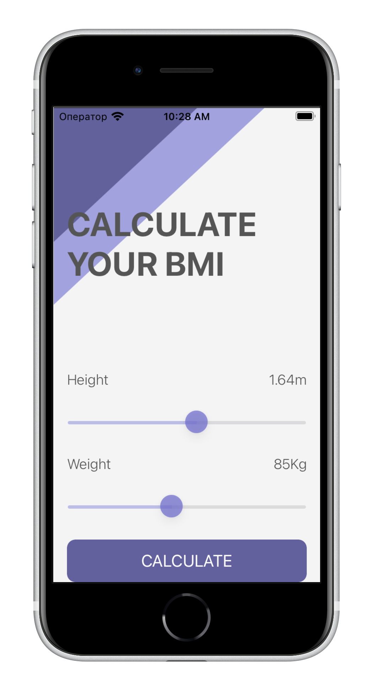
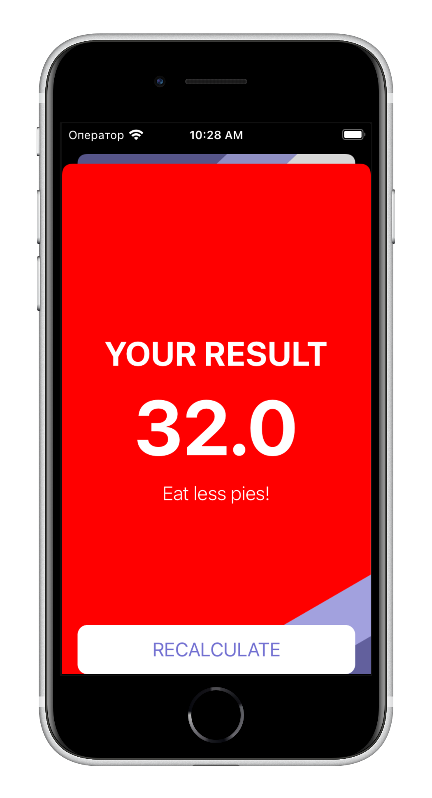

#  BMI Calculator

Body Mass Index calculator. Based on the user's weight and height, it will calculate their body weight and give health recommendations depending on whether they ate too much or they need to eat more.

## What has been studied

* How to create multi-screen apps with animated navigation.
* Optional binding, optional chaining and the nil coalescing operator.
* How to create classes and difference between classes and structs. 
* Pass by value vs. pass by reference. 
* Formatting Strings. 
* Color literals.

